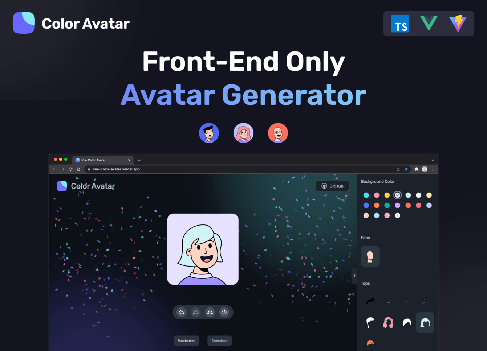

<div align="center">
  <h1>DIY-Avatar</h1>

  <p>🧑‍🦱 一个纯前端实现的头像生成网站 🧑‍🦳</p>

[Read in English](./README.md)

</div>

<a href="https://Msliuyongqiang.github.io/DIY-Avatar">
  
</a>

## 在线预览

[`https://Msliuyongqiang.github.io/DIY-Avatar`](https://Msliuyongqiang.github.io/DIY-Avatar)

## 介绍

**这是一款矢量风格头像的生成器，你可以搭配不同的素材组件，生成自己的个性化头像。**

你可能感兴趣的功能：

- 可视化组件配置栏
- 随机生成头像，有一定概率触发彩蛋
- 撤销/还原*更改*
- 国际化多语言
- 批量生成多个头像

## 深度了解项目

想要深入了解项目架构、代码组织和技术实现？

🔍 **[访问 DeepWiki 智能文档](https://deepwiki.com/Codennnn/vue-color-avatar)**

DeepWiki 使用 AI 技术自动分析了整个项目，提供：

- 📋 项目架构概览
- 🔍 代码结构分析
- 💡 核心功能解读
- 🗺️ 组件依赖关系图
- 🚀 实现细节与最佳实践

_非常适合新手快速上手和贡献者深入理解项目_

## 设计资源

- 设计师：[@Micah](https://www.figma.com/@Micah) on Figma
- 素材来源：[Avatar Illustration System](https://www.figma.com/community/file/829741575478342595)

> **Note**  
> 虽然该项目是 MIT 协议，但是素材资源基于 [CC BY 4.0](https://creativecommons.org/licenses/by/4.0/) 协议。如果你有好的创意素材，欢迎补充！

## 项目开发

该项目使用 `Vue3` + `Vite` 进行开发。

```sh
# 1. 克隆项目至本地
git clone https://github.com/Codennnn/vue-color-avatar.git

# 2. 安装项目依赖
yarn install

# 3. 运行项目
yarn dev
```

### Docker 快速部署

```sh
#下载代码
git clone https://github.com/Codennnn/vue-color-avatar.git

#docker 编译
cd vue-color-avatar/
docker build -t vue-color-avatar:latest .

#启动服务
docker run -d -p 3000:80 --name vue-color-avatar vue-color-avatar:latest
```

最后，打开你的浏览器访问服务的地址 http://localhost:3000 即可。
